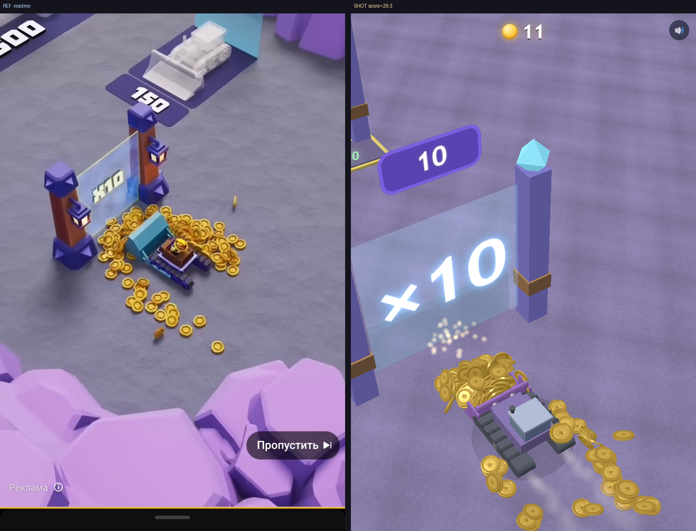
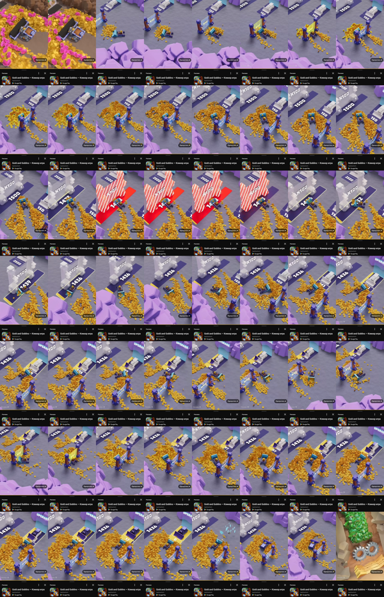
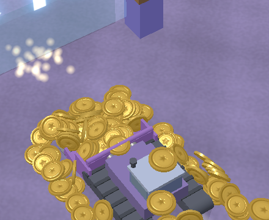
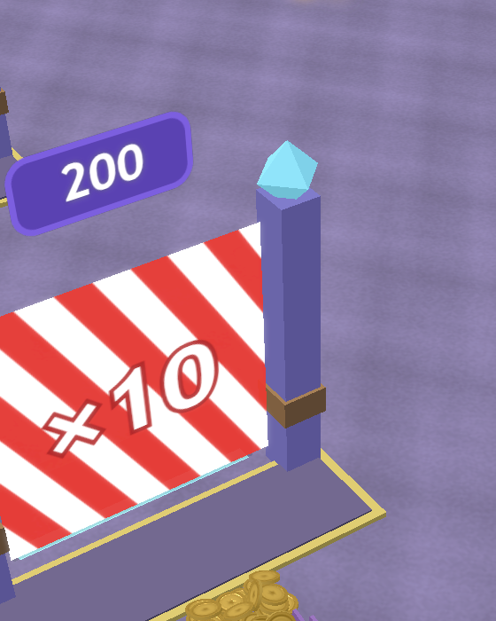
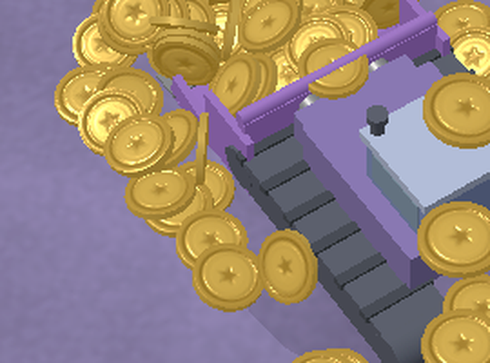
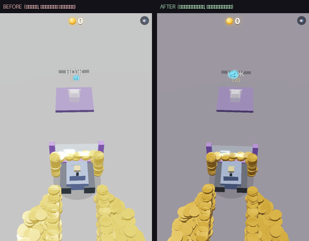

# ЗОЛОТОДОЗЁР · Gold Harvester

Браузерная 3D-игра на Three.js + Rapier: изометрический бульдозер ковшом-корытом сгребает **настоящие физические** золотые диски, копит их в воротах-замках, открывает множители ×N и раскручивает экономику.

**Главная цель проекта — максимально точно воспроизвести физику, геймплей и дизайн из референс-ролика [`demo.mp4`](demo.mp4)** (рекламный креатив Gold and Goblins, AppQuantum). Не сам idle/merge-геймплей Gold and Goblins, а именно ощущение «дозер + золото + ворота + пады» из ролика — **миниатюрная реалистичность**: веришь, что это маленькие тяжёлые кусочки металла.


<sub>Слева — кадр-эталон из ролика, справа — рендер. Сравнение генерится автоматически (`tools/compare.py`).</sub>

---

## TL;DR

```bash
npm install && npx playwright install chromium

npm run dev      # разработка: http://localhost:5173 (HMR)
npm run build    # dist/index.html — самодостаточный файл, открывается по file://

npm run shoot    # цикл сравнения: рендер 4 бет -> out/shot_*.png
npm run clip     # мотион-клип проезда -> out/clip.mp4
python tools/compare.py refs/keyframes/kf_establish.png out/shot_establish.png
```

Играть: тяни мышью/пальцем или WASD/стрелки.

---

## Почему так, а не «ещё раз подвигать константы»

Прошлые попытки клонировать ролик тюнились **на глаз** — и не сходились. Корень: ТЗ требует судить картинку по реальному рендеру (§8), но не было ни кадров-эталонов, ни рендер-харнесса, ни детерминизма. Репозиторий построен вокруг **измеримого цикла**:

```
   refs/            tools/shoot|clip      tools/compare.py        src/config.js CFG
 ┌─────────┐        ┌───────────┐        ┌──────────────┐        ┌───────────┐
 │ эталон  │  ──▶   │  рендер   │  ──▶   │ метрики+глаз │  ──▶   │  правка   │  ──┐
 └─────────┘        └───────────┘        └──────────────┘        └───────────┘    │
      ▲                                                                            │
      └────────────────────────────────────────────────────────────────────────┘
```

Каждая правка цвета/камеры/физики проверяется рендером, сравнивается с эталоном по числам **и** глазами, и принимается только если приближает к рефу. Статика ловит палитру/композицию, мотион-клип — поведение физики. Методика подробно — в [METHOD.md](METHOD.md).

**Принцип:** где ролик расходится с текстом ТЗ — **главнее ролик** (лавандовый грунт, красно-белые ворота).


<sub>Контактный лист `demo.mp4` (2 кадра/с): первая ячейка — заставка-ковёр (фаза A, не цель), дальше геймплей (фаза B — цель клонирования). Разметка — в [refs/phases.md](refs/phases.md).</sub>

---

## Структура репозитория

```
demo.mp4              референс-ролик (720×1280, 28 c) — источник истины
spec.md               исходное ТЗ
index.html            Vite-энтри (HTML/CSS + <script module src=src/main.js>)
vite.config.js        сборка в ОДИН dist/index.html (vite-plugin-singlefile, WASM инлайном)

src/
  main.js             сцена/дозер/ковш/монеты/ворота/пады/HUD/bloom/цикл/__sim
  physics.js          мир Rapier: тела монет, кинематический ковш, контакты
  config.js           CFG: все тюнеры (палитра/камера/физика/звон) + seeded rnd()
  state.js            общие синглтоны (апгрейды, банк, фаза)
  audio.js            двигатель (тарахтенье), звон монет, джинглы
  coinsfx.js          банк реальных монетных «дзынь» (ogg base64, royalty-free)

refs/
  phases.md           разбор ролика по фазам
  keyframes/          кадры-мишени (establish/hill/spread/pad)
  frames/             все кадры ролика (.gitignore, восстанавливаются extract.sh)

tools/
  extract.sh          ffmpeg: demo.mp4 -> кадры + контактный лист
  shoot.mjs           Playwright: детерминированный рендер 4 бет
  clip.mjs            мотион-клип проезда -> out/clip.mp4 (сверка ДВИЖЕНИЯ)
  compare.py          метрики палитры/яркости (hue-маски) + side-by-side + SCORE
  _probe.mjs          физика-проба: carry/turn/settle/laps + coinStats
  _makecoinsfx.py     пересборка банка монетных сэмплов из refs/*.wav

out/                  рендеры, композиты, клипы (.gitignore)
```

---

## Игровые системы (текущее состояние)

- **Физика монет — Rapier** (`@dimforge/rapier3d-compat`, WASM): до 700 динамических цилиндров-дисков. Плотные/тяжёлые (density 9, тяжёлая гравитация), почти не скачут, сгребаются в кучи с углом откоса, кувыркаются настоящим кватернионом.
- **Анти-джиттер**: деадзона покоя (почти неподвижная лежащая монета замораживается+спит), активный «завал» вставших на ребро (доворот к плашмя), потолок скорости (не «улетают мячом»), фикс-шаг 1/60 с аккумулятором.
- **Ковш фронтального погрузчика** — кинематическое тело: глубокая U-чаша непрерывной цепочкой сегментов (дно плавно загибается в высокую стенку), козырёк-отбойник нависает над чашей, бортики с лёгким развалом, прямая режущая кромка с зубьями. Отстоит от траков с зазором, крепится «шпалами» снаружи траков. Движется через `setNextKinematic*` → отдаёт импульс монетам.
- **Ворота-замки**: заперты (красный шеврон) — широкий жёлтый мат перед аркой копит ссыпанные монеты в бар; на `cost` открываются навсегда и множат проходящие монеты ×N (с копиями из пула).
- **Один апгрейд-пад** (шире ковш) — наполняется и исчезает.
- **Старт с 5 монет** — корралинг узким источником + задняя стенка; коридор-стенки держат золото в полосе ворот.
- **Дозер**: модель-миниатюра по реф-замерам (пропорции — из мерных штрихов пользователя на кадре рефа): деревянный короб-кабина во всю платформу с гоблином в каске, креслом и рычагами; тонкие тёмно-фиолетовые гусеницы внутри габарита ковша; светлая платформа. Коллайдер-конверт (монеты не застревают), блок столбами ворот/стойками падов, крутящиеся гусеницы, плавный подъём на матах падов и ворот (с упреждением по скорости — ковш не «тонет»).
- **Звук**: контактные «дзынь» — реальные сэмплы монет (8 нарезанных клинков, случайная высота/громкость), триггер от contact-force событий Rapier только при реальном ударе (скольжение/покой молчат); тарахтящий двигатель; джинглы.
- **Визуал**: монеты с гравировкой (кольцо+звезда, bumpMap), процедурная фактура земли, праздничная палитра под реф, bloom-пайплайн.

| Ковш несёт золото | Запертые ворота: мат + бар | Монеты: рельеф |
|---|---|---|
|  |  |  |

---

## Детерминизм (ядро методики)

- `?test=1&seed=N` — авто-старт + seeded-RNG (mulberry32). Физика Rapier — CPU/WASM, фикс-шаг: **один seed → бит-в-бит одинаковая симуляция** (проверено чексуммой позиций всех тел между прогонами).
- `CFG` (src/config.js) — все тюнеры; override `?key=val` или `window.__cfg` — свип параметра без правки кода.
- `window.__sim` — API харнесса: `step/run/setTarget/setPose/state/render/coinStats/coinSum`.
- `ready` поднимается только после `await RAPIER.init()` + создания тел.

Перф: ~4.3 мс/шаг при 500 живых монетах (бюджет 60 fps — 16.6 мс).

---

## Прогресс клонирования

Палитра сведена с эталоном по hue-маскам (грунт/золото/яркость): SCORE establish **150 → 29** по измеренным проходам (грунт-лаванда, золото без «латуни» и синевы от окружения, ровная яркость без пересвета).

**Камера откалибрована по рефу строго**: семейства прямых (вертикали столбов / вдоль коридора / поперёк) → исчезающие точки → фокус и матрица поворота. Финал — совместный фит по осевым линиям, размеченным пользователем: **yaw 49.4°, pitch 54.5°, f 1600px**, остаточная ошибка 0.65° (вертикали сходятся в 1.6°). Методика с самопроверкой и уроками — в [METHOD.md](METHOD.md). Зум — колесом мыши (наклон сохраняется).

**Дозер и ковш** перестроены по реф-замерам: пропорции — из мерных штрихов пользователя, пересчитанных в мировые единицы через проекцию (ковш 0.84×базы, ящик 0.36, высота 0.51 — все три в цель); форма ковша — по спеке глубокой U-чаши.


<sub>Исторический кадр первого прогона методики: до — серый грунт и бледное золото «на глаз»; после — палитра, подогнанная по метрикам.</sub>

Открытые хвосты: финальная сверка дозера/ковша в динамике, авто-сбор рассыпанного золота, тюн стоимостей под 5-монетный старт.

---

## Стек и требования

- **Игра:** Three.js r184 + @dimforge/rapier3d-compat (npm), Vite + vite-plugin-singlefile → один `dist/index.html` (работает по `file://`). Целевой перф — 60 fps на среднем телефоне.
- **Тулинг:** Node 18+ (Playwright, Vite), Python 3.9+ (Pillow, numpy, scipy), ffmpeg.

## Лицензия

Учебный прототип/клон для воспроизведения ощущения из референса. `demo.mp4` принадлежит правообладателю Gold and Goblins (AppQuantum) и используется только как референс. Звуковые сэмплы монет — royalty-free (sfxengine.com), нарезка вшита в `src/coinsfx.js`; исходные wav не коммитятся.
